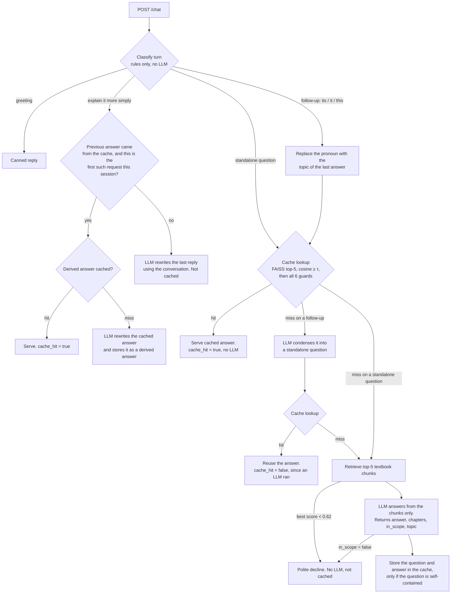

# NCERT Class 10 Science Doubt-Solver: How It Works

**The idea in one line:** reuse a past answer only when the new question asks *exactly the same thing*. Embedding similarity finds candidate answers. Cheap deterministic checks decide whether a candidate can be reused. A wrong hit teaches a student something false, so whenever the system is unsure, it treats the question as a miss and asks the LLM.

## Request flow

## The chatbot

- **Ingestion.** I downloaded all 13 chapters of the current edition from ncert.nic.in and extracted them with `pypdf`. Cleanup removed running headers, page numbers and repeated "Activity 9.3Activity 9.3…" banners. The text was split into 665 chunks of about 900 characters, each tagged with its chapter. They are embedded with `bge-small-en-v1.5`, which runs locally through fastembed/ONNX, and stored in a **FAISS** index via LangChain.
- **Answering.** Groq's `openai/gpt-oss-120b` is called through LangChain's OpenAI-compatible client and returns structured output `{answer, chapters, in_scope, topic}`. Citations are checked against the chapters that were actually retrieved, so the model can't cite a chapter it never saw.
- **Out of scope.** If the best chunk score is below 0.62, the bot declines without calling the LLM. In-book questions scored 0.71 or higher in testing; off-topic ones scored 0.42–0.65. In the grey zone, the LLM's `in_scope` flag makes the call.
- **Multi-turn.** The pipeline is a **LangGraph** state machine. Follow-ups are resolved with a small LLM call that rewrites them as standalone questions. The answer is then generated from that standalone question alone, without chat history, so it can be safely reused for any student.

## The cache

Each cache entry stores the standalone question, its embedding, the answer, the citations and a topic. Entries live in SQLite, and a FAISS index is rebuilt when the server starts. **Lookup** takes the top 5 neighbours with cosine similarity of at least 0.86. A neighbour must then pass **every** guard below:

| Guard | Catches |
|---|---|
| Numbers and signs match exactly | R = 20 cm vs R = 30 cm; u = 10 vs u = −10 |
| Contrast pairs (about 60 hand-curated) | concave/convex, mirror/lens, series/parallel, aerobic/anaerobic, xylem/phloem… |
| Content-word sets equal (after lemmatising and synonyms) | "laws of refraction" vs "laws of reflection", plants vs animals |
| Same intent (what / why / how / difference / uses / example / numerical…) | "What is refraction?" vs "Why does refraction occur?" |
| Same negation | "metals that react" vs "metals that do **not** react" |
| Word order, when the question has from/to/into | light going from air to glass vs from glass to air (similarity 0.994!) |

**Measured** on 39 labelled pairs (`scripts/eval_cache.py`):

| Method | Correct reuse | False hits | Correct misses | Missed reuse |
|---|---|---|---|---|
| Similarity alone | 14 | **16** | 8 | 1 |
| Similarity + guards | 14 | **0** | 24 | 1 |

A cache hit makes **no LLM call**. The local embedding takes about 15 ms and the FAISS search under 1 ms, so a hit returns in about 20–60 ms end to end. Tests assert both properties, using a fake LLM that counts its calls.

### Multi-turn cases (the "depends" and "think carefully" rows)

- **"What about its laws?"** "its" is replaced with the topic of the previous answer, giving "refraction laws". That string goes through the same guards, with a stricter threshold of 0.90. With no conversation behind it, a dangling pronoun is never looked up or stored.
- **"Explain it more simply"** depends on the previous answer, not on the words typed. It is keyed as *(cache entry it refers to, transform type)*. A second student who got the same cached answer and asks for a simpler version gets the stored simplified answer with no LLM call. Asking for "even simpler" in the same conversation goes to the LLM and is not cached.

### What I cache and what I never cache

**Cached:** in-scope answers to self-contained questions, generated without chat history. Also simplify / example / summary / points / elaborate rewrites of a *cached* answer.
**Never cached:** declines and out-of-scope questions, greetings, answers that depended on the conversation, questions with an unresolved pronoun, repeated rewrite requests in the same conversation, and failed LLM calls.

## What didn't work, and the trade-offs

- **A similarity threshold alone can't be tuned to be safe.** "concave/convex mirror" scores 0.936, "air→glass / glass→air" 0.994 and "exothermic/endothermic" 0.908, all above genuine paraphrases such as "State Ohm's law / What is Ohm's law?" at 0.883. Any threshold that keeps the paraphrases also lets those pairs through. That is why the guards exist.
- **Exact matching after normalisation** was safe but missed almost every paraphrase.
- **PDF extraction** needed cleanup, and one page in the Heredity chapter is a vector drawing over 75 MB that tripped pypdf's decompression limit.
- **Known limitation:** true synonyms such as "myopia" and "short-sightedness" are missed. They score only 0.705 and their words differ. That costs one extra LLM call, never a wrong answer. A larger synonym table, or an offline-tuned cross-encoder that still makes no LLM call, would raise the hit rate.
